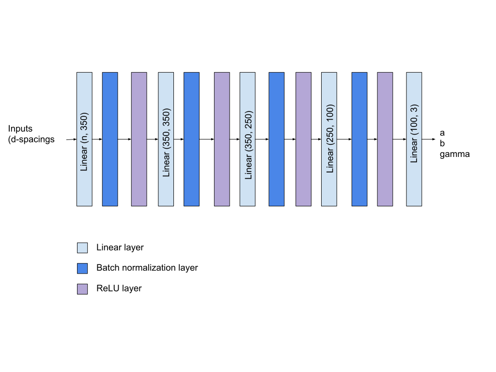

==============
 Introduction
==============

 The determination of crystal lattice parameters, or indexing, from 2D powder diffraction data is a mathematically ill-defined problem, which is hard to solve using traditional optimization techniques.  This software package provides a hybrid neural network/iterative method that performs it quickly and reliably.  This is a modernization of the work done by :cite:`habershon_powder_2004`, which has the same basic architecture (an artificial neural network followed by local optimization), but we consider specifically the 2D case with any symmetry
 The code is applied to indexing grazing-incidence x-ray scattering (GIXS) of molecular thin films, of interest in the rapidly evolving field of organic electronics. Typical problems are low lattice symmetry (monoclinic, triclinic) and novel thin film structures that may depend on the deposition method and the substrate, and are different from the usually known single crystal bulk structures. The method is also suitable for indexing equatorial reflections in fiber diffraction. In either case the lattice parameters can be split up into finding the in-plane surface unit cell with 3 lattice constants, and as a second step determining the other 3 lattice parameters in analyzing the full GIXS pattern. The first step is typically the more difficult - after the in-plane lattice is determined, the out-of-plane lattice parameters can be found comparatively easy.
    
================================
 Methods and Model Architecture
================================

----------------------------------
Neural Network and Artificial Data
----------------------------------

The first part of the model is a small fully connected multilayer perceptron (MLP) with 5 linear layers, ReLU activation, and batch normalization applied before activation :cite:`ioffe_batch_2015`.  The network architecture is fixed for a given number of input spacings, and the output is an array of the predicted a,b, and gamma values.  The network is trained on hallucinated data--random a,b, and gamma values are chosen in the range  :math:`\begin{cases} 0.3 \le a < 1.5 \\ 0.2 \le b < 2.5 \\ 85 \le \gamma < 130 \end{cases}`, then passed through the equation :math:`d_{hk} = \frac{\sin(\gamma)}{\sqrt{\frac{H^2}{a^2} + \frac{K^2}{b^2} - \frac{2HK \cos(\gamma)}{ab }}}` to generate d-spacings.  The *n* lowest spacings, sorted in ascending order, is a single input to the model.  Before training, 10000 inputs are randomly generated and their mean and variance are recorded, which is used on all model inputs to normalize them to zero mean and unit variance.  Training was done using the Adam optimizer, an initial learning rate of 1e-3 which was decayed by a factor of 0.5 every 25 epochs, and for 75 total epochs :cite:`kingma_adam:_2014`; Adam is the current standard optimizer for most neural networks.  Every epoch, a new dataset of 10000 inputs was randomly generated and passed through the network once.  A separate hallucinated dataset of 1000 inputs is used for validation.

   Visual schematic of model architecture.

The predicted lattice parameters from the MLP are typically close to the true parameters, but off by about 10-20%.  The output is used as a guess for a standard iterative optimizer, which in this case, is the BFGS algorithm as implemented in scipy.optimize.  The objective function is the L2 distance between the calculated d-spacings from the predicted lattice parameters and the observed d-spacings.  For hallucinated data, the optimizer is able to reliably obtain the exact lattice parameters, with error limited by the tolerance and stopping parameters of the solver.

Both parts of the model are necessary to get a good prediction of lattice parameters: the neural network on its own has an error of around 20%, and iterative optimization on its own, without a good initial guess, very often diverges and does not find a solution.  Simulated annealing (as implemented in scipy.basinhopping) can find the correct solution but will also find extraneous solutions that also minimize the d-spacing distance but with incorrect wrong lattice parameters.

------------------
Previous Attempts
------------------
The neural network architecture was modified several times before settling on this one.  When many (20 or more) spacings are available, the network’s predicted parameters are very close to the true parameters, but this degrades quickly when less data is available.  When evaluating on an evaluation set with 1% random noise, the average test error was worse when the inputs had the same noise than when there was no noise.  Performance did not greatly improve with wider and deeper networks, and getting slightly better neural network performance is not important as it must only be good enough for the iterative optimizer to locate the correct optimum.  Batch normalization and separate data normalization were both essential in the performance of the network.  ReLU was found to converge faster and better than other nonlinearities like sigmoid or hyperbolic tangent.

-------------------------
Drawbacks and Limitations
-------------------------
The model is not general for any number of observed spacings; a new neural network must be trained for each *n*, and only that network may be used for indexing that *n*.  While this is rather inefficient, since the model is quite simple, it is quick to train all of these models and their saved versions do not take up much storage space.  In addition, the model was trained and evaluated on data without noise, not real accelerator data.  The good results on artificial data may not generalize to observed data.

.. bibliography:: powder.bib
