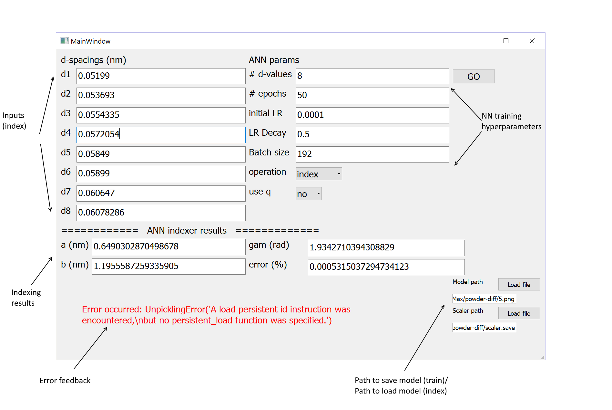

=====
Usage
=====

-------------
Prerequisites
-------------
First, install prerequisites (omit --user if in a virtual environment, recommended)::

  pip install --user -r requirements.txt

To build documentation, additionally run::

  pip install --user -r requirements_doc.txt

-------
Running
-------
All user level commands are performed using `main.py`.  At the command line::

  python main.py <arguments> 

List of command line arguments:

.. argparse::
   :module: main
   :func: parser_generator
   :prog: main

Additionally, a GUI is available.

